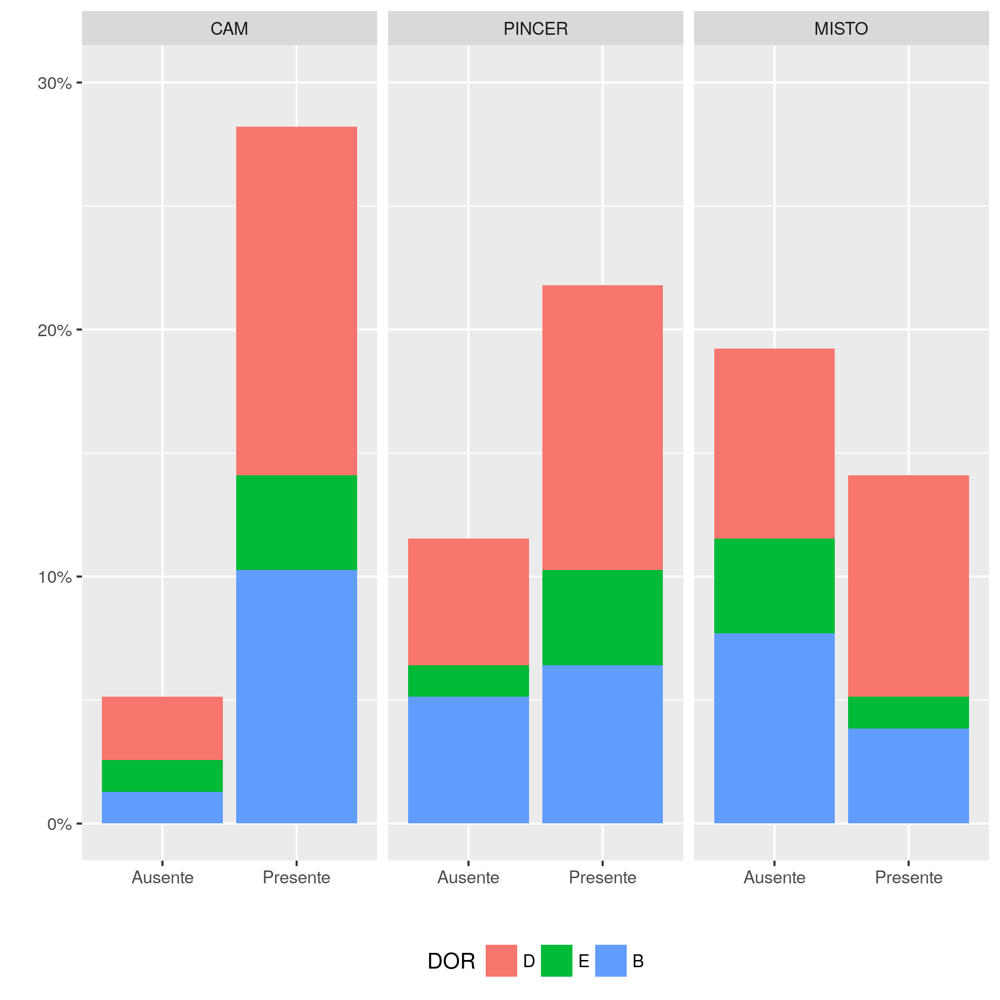
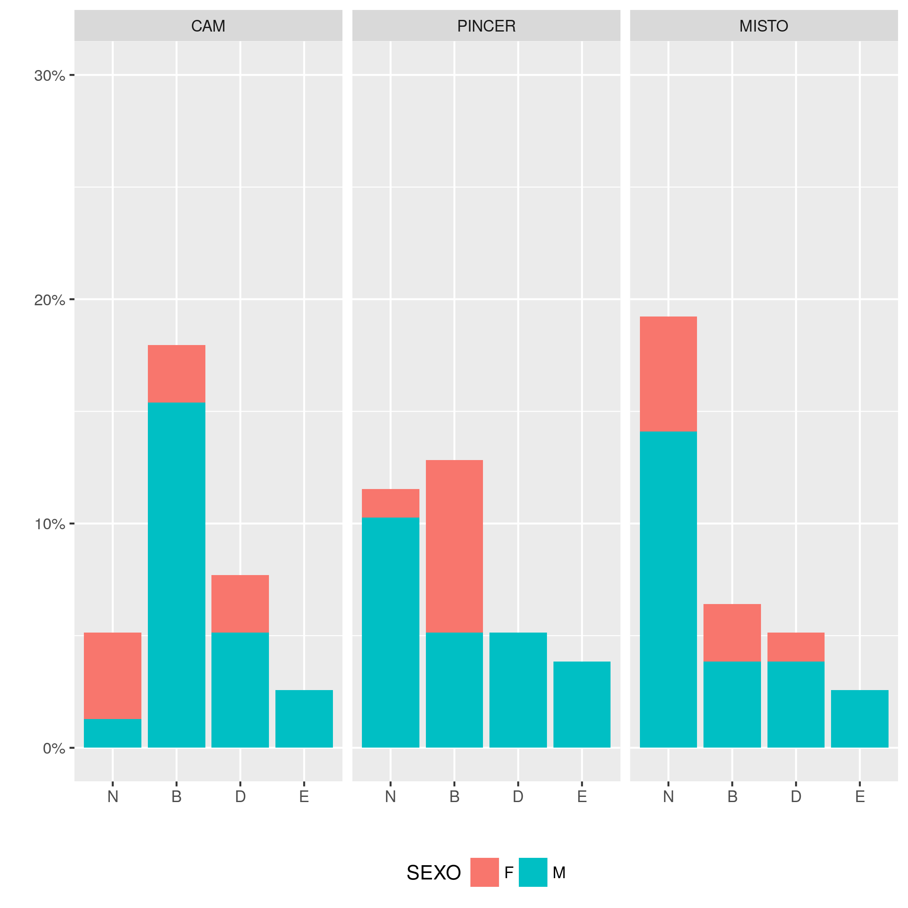
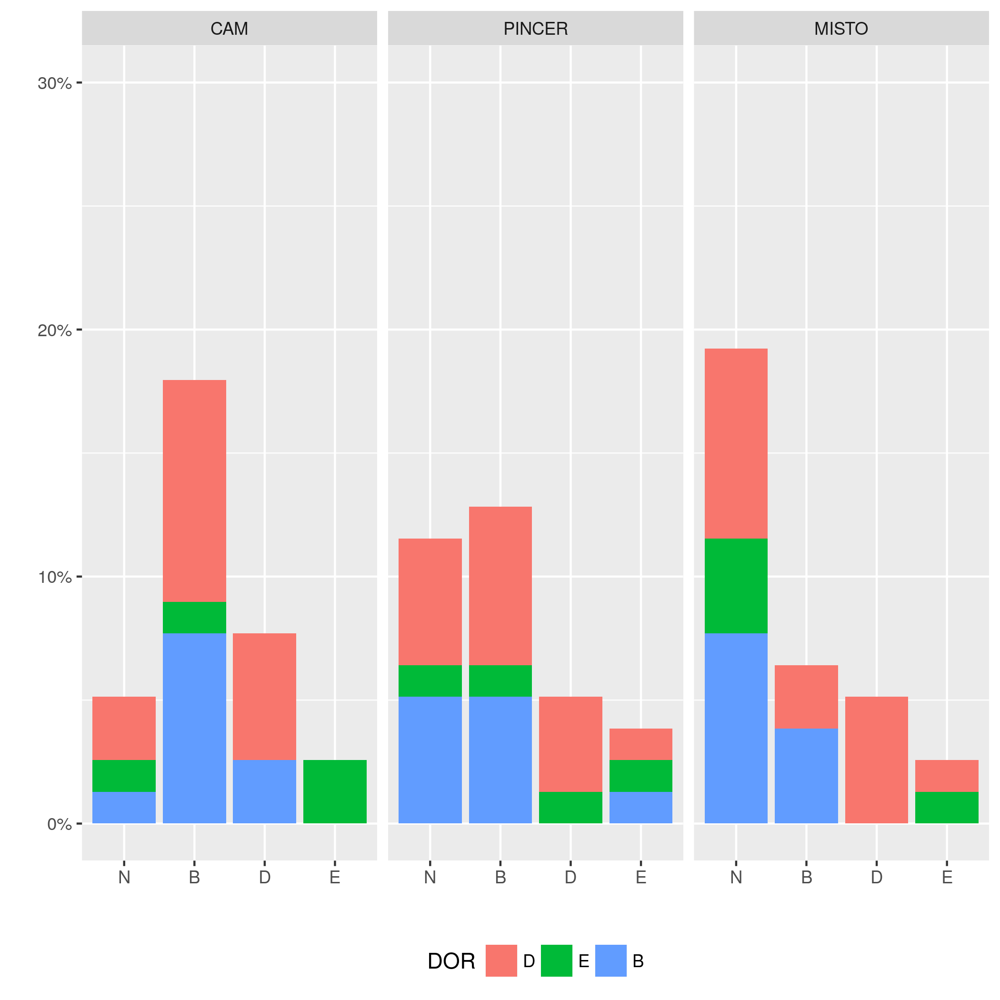

```{r setup, include=FALSE}
knitr::opts_chunk$set(echo = FALSE)
knitr::opts_knit$set(root.dir = normalizePath(".."))
options(scipen = 999)
library(pander)
library(knitr)
library(philsfmisc)
panderOptions('table.style', 'rmarkdown')

```

---

**Histórico do documento**

```{r, echo = FALSE}
Version <- c("01")
Changes <- c("Versão inicial")
history <- cbind(Version, Changes)
colnames(history) <- c("Versão", "Alterações")
pander(history, split.cells = 70)
# kable(history)
```

---

# Lista de abreviaturas

# Introdução

## Objetivos

## Recepção e tratamento dos dados

# Metodologia

## Diagnóstico sistemático

As medidas obtidas por avaliação clínica e radiológica foram utilizadas para classificar sistematicamente o tipo de impacto.
Foram considerados impactos CAM aqueles participantes que tinham ângulo alfa maior que 50 graus.
Para classificar o impacto do tipo PINCER foi considerada qualquer uma das seguintes medidas:

- índice acetabuar maior que 10 graus;
- ângulo centro-borda acetabular maior que 39 graus;
- índice de extrusão menor que 10 graus.

Participantes que possuíam tanto impacto CAM quanto PINCER no mesmo lado do quadril foram posteriormente classificados como impacto MISTO.
Observe que isto não considera um paciente com CAM em um lado e PINCER no outro como um paciente de impacto MISTO.

### Exceções

**CAM**

Um participante não teve seu ângulo alfa mensurado no lado direito, ele foi diagnosticado clinicamente como não possuindo impacto CAM.

**PINCER**

Um segundo participante não teve seu ângulo centro-borda cetabular mensurado no lado direito, e seu diagnóstico clínico foi de que não possuía PINCER.
Um terceiro participante não teve seus índices de extrusão mensurados em ambos os lados.
Seu diagnóstico clínico foi de que possuía PINCER apenas no quadril esquerdo.

## Análises estatísticas

As variáveis categóricas foram avaliadas quanto às suas frequências, sendo apresentadas em porcentagem.
Associações entre duas variáveis categóricas foram avaliadas usando-se o teste exato de Fisher.
As variáveis contínuas foram descritas com médias e desvio padrão.
As diferenças médias entre dois grupos de medidas foram avaliadas com o teste t de Student.

Além dos testes de significância, diversos modelos estatísticos foram criados para avaliar hipóteses sobre a relação entre os desfechos de interesse e os ângulos mensurados, como torção.

<!-- Para as hipóteses em que o desfecho era uma variável categórica binária, foi utilizado o modelo de regressão logística. -->
Quando o desfecho era uma variável categória com 3 ou mais categorias, como por exemplo o lado doloroso (direito, esquerdo ou bilateral) usou-se o modelo de regressão multinomial.

Esta estratégia de modelagem permite estimar a Razão de Chance de uma determinada combinação de fatores e medidas afetar a probabilidade de trocar de uma categoria para outra.
Por exemplo, o tipo de impacto que o participante apresenta pode aumentar a chance do participante sentir dor naquele lado, mas isso pode ocorrer de forma diferenciada para cada gênero, ou ser influenciada pelo ângulo de torção, IMC, etc.
Assim é possível controlar o efeito observado por outros fatores que possam estar relacionados.

Para avaliar a influência de diversos fatores na medida do ângulo de torção, foram usados modelos de regressão linear múltipla, o que permite controlar a observação do efeito por fatores adicionais que possivelmente influenciam no valor deste ângulo.

Todas as análises foram realizadas utilizando-se o software `R` versão `r getRversion()`.

<!-- The exact confidence intervals (CIs) of binomial proportions were calculated using package `exactci` (version `r packageVersion("exactci")`). -->

# Resultados

```{r include=FALSE}
source('scripts/descritiva.R', encoding = 'UTF-8')
```

## Descrição dos participantes do estudo

```{r echo=FALSE}
pander(tab1)
```

Table: **Tabela 1** Descrição dos participantes do estudo (N = 26).
sd = Desvio padrão,
IMC = Índice de massa corpórea,
HHS = Harris hip score (modificado).

```{r echo=FALSE}
pander(sum.lado)
panderOptions('table.split.table', 120)
```

Table: **Tabela 2** Descrição das mensurações avaliadas e os tipos de impacto em cada lado do quadril.
sd = Desvio padrão,
ALFA = ângulo alfa,
IA = índice acetabular,
ACB = ângulo centro-borda acetabular,
EXTRU = índice de extrusão.
p = teste t de Student para variáveis contínuas, e teste exato de Fisher para impacto.

Observou-se que, na média, o ângulo alfa foi significativamente maior no lado direito dos pacientes que o medido no lado esquerdo (Tabela 2).
As outras mensurações parecem ser homogeneamente distribuídas em ambos os lados.
O mesmo ocorre com a distribuição de frequências doso tipos de impacto em ambos os quadris de cada paciente.

## Características de cada gênero

```{r}
pander(sum.gen)
```

Table: **Tabela 3** Mensurações avaliadas e tipos de impacto observados por gênero.
sd = Desvio padrão,
IMC = Índice de massa corpórea,
p = teste t de Student para variáveis contínuas, e teste exato de Fisher para impacto.

o IMC médio dos homens é significativamente maior que o das mulheres (tabela 3).
Parece haver boa homogeneidade quanto ao gênero, nas idades e tipos de impacto dos participantes.

## Características pelo lado doloroso

```{r}
pander(sum.dor)
```

Table: **Tabela 4** Descrição dos participantes quanto ao lado doloroso.
sd = Desvio padrão,
IMC = Índice de massa corpórea,
p = teste t de Student para variáveis contínuas, e teste exato de Fisher para impacto.

Não houve associação significativa entre idade, IMC

Os participantes brancos e de outras raças tem distribuições semelhantes de gênero
(p = `r format.pval(fisher.test(with(dados, table(RACA, SEXO)))$p.value, digits = 4)`),
idade 
(p = `r format.pval(with(dados, t.test(IDADE~RACA))$p.value, digits = 4)`).
Os participantes brancos tem IMC ligeiramente menor que de outras raças
(p = `r format.pval(with(dados, t.test(IMC~RACA))$p.value, digits = 4)`).
Não houve diferença entre os participants brancos e de outras raças quanto à observação de CAM
(p = `r format.pval(fisher.test(with(dados, table(RACA, CAM)))$p.value, digits = 4)`),
PINCER
(p = `r format.pval(fisher.test(with(dados, table(RACA, PINCER)))$p.value, digits = 4)`)
ou impacto MISTO
(p = `r format.pval(fisher.test(with(dados, table(RACA, MISTO)))$p.value, digits = 4)`).

## Frequências dos impactos

```{r}
pander(with(impacto, table(CAM, PINCER)))
```

Table: Impactos CAM x PINCER, p-value = 0.2631

```{r}
pander(with(impacto.lat, table(CAM, PINCER)))
```

Table: Impactos CAM x PINCER, levando em conta lateralidade p-value = 0.1918

Há 2 participantes que tem simultaneamente CAM e PINCER, mas em lados diferentes (1 participante tem CAM D e PINCER E, e o outro tem CAM E e PINCER D).
Por isso, não são contabilizados como casos de impacto MISTO.



## Por sexo

Os impactos ocorrem de forma diferenciada por sexo?

### Geral

```{r}
pander(with(impacto, table(CAM, SEXO)))
```

Table: CAM p-value = 0.04682

```{r}
pander(with(impacto, table(PINCER, SEXO)))
```

Table: PINCER p-value = 0.3574

```{r}
pander(with(impacto, table(MISTO, SEXO)))
```

Table: MISTO p-value = 1.000

### Controlado pelo lado do impacto

```{r}
pander(with(impacto.lat[CAM != "N"], table(CAM, SEXO)))
```

Table: CAM p-value = 0.7014

```{r}
pander(with(impacto.lat[PINCER != "N"], table(PINCER, SEXO)))
```

Table: PINCER p-value = 0.06238

```{r}
pander(with(impacto.lat[MISTO != "N"], table(MISTO, SEXO)))
```

Table: MISTO p-value = 1.000




## Por lado de dor

O impacto é um bom preditor para em que lado o participante sente dor?

### Geral

```{r}
pander(with(impacto, table(CAM, DOR)))
```

Table: CAM p-value =  1.000

```{r}
pander(with(impacto, table(PINCER, DOR)))
```

Table: PINCER p-value = 0.8616

```{r}
pander(with(impacto, table(MISTO, DOR)))
```

Table: MISTO p-value = 0.5662

### Controlado pelo lado do impacto

```{r}
pander(with(impacto.lat[CAM != "N"], table(CAM, DOR)))
```

Table: CAM p-value = 0.07675

```{r}
pander(with(impacto.lat[PINCER != "N"], table(PINCER, DOR)))
```

Table: PINCER p-value = 0.5243

```{r}
pander(with(impacto.lat[MISTO != "N"], table(MISTO, DOR)))
```

Table: MISTO p-value = 0.1333



<!-- # Exceções e Desvios do teste -->

# Conclusões


# Referências

# Apêndice

