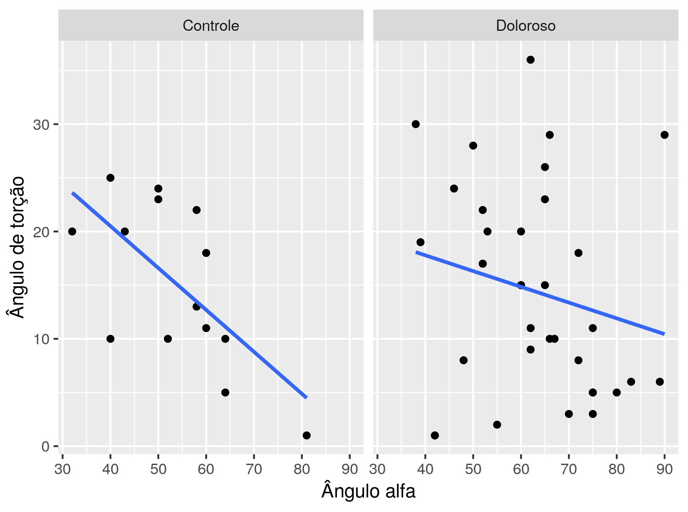

```{r setup, include=FALSE}
knitr::opts_chunk$set(echo = FALSE)
knitr::opts_knit$set(root.dir = normalizePath(".."))
options(scipen = 999)
library(pander)
library(knitr)
library(philsfmisc)
panderOptions('table.style', 'rmarkdown')

```

---

**Histórico do documento**

```{r, echo = FALSE}
Version <- c("01")
Changes <- c("Versão inicial")
history <- cbind(Version, Changes)
colnames(history) <- c("Versão", "Alterações")
pander(history, split.cells = 70)
# kable(history)
```

---

# Lista de abreviaturas

# Introdução

## Objetivos

## Recepção e tratamento dos dados

# Metodologia

## Algoritmo de classificação dos impactos nos quadris

As medidas obtidas por avaliação clínica e radiológica foram utilizadas para classificar sistematicamente o tipo de impacto.
Os três tipos de impacto (CAM, PINCER e MISTO) foram determinados a partir das mensurações obtidas, conforme os seguintes critérios:

- Impacto do tipo CAM
    - ângulo alfa maior que 50 graus.
- Impacto do tipo PINCER
    - índice acetabular negativo;
    - ângulo centro-borda acetabular maior que 39 graus;
    - índice de extrusão menor que 10 graus.
- Impacto do tipo MISTO
    - Identificação simultânea de impacto CAM e PINCER

As mensurações foram obtidas de forma independente para o quadril direito e esquerdo de cada participante (N = 26).
Com isso, estes critérios foram aplicados a cada quadril (N = 52).
Assim, um paciente com impacto CAM em um lado e PINCER no outro não teve classificação de impacto MISTO em nenhum dos lados.

### Exceções

Três participantes não tiveram todas as mensurações obtidas, o que inviabilizou a classificação de CAM ou PINCER com a metodologia acima descrita.
Estas exceções foram tratadas caso a caso, conforme descrito a seguir.

**CAM**

Um participante não teve seu ângulo alfa mensurado no lado direito, ele foi diagnosticado clinicamente como não possuindo impacto CAM.

**PINCER**

Um segundo participante não teve seu ângulo centro-borda acetabular mensurado no lado direito, e seu diagnóstico clínico foi de que não possuía PINCER.

Um terceiro participante não teve seus índices de extrusão mensurados em ambos os lados.
Seu diagnóstico clínico foi de que possuía PINCER apenas no quadril esquerdo.

## Análises estatísticas

Todas as análises foram realizadas utilizando-se o software `R` versão `r getRversion()`.
O critério de significância estatística foi p-valor < 0.05.

### Análise descritiva

As variáveis categóricas foram avaliadas quanto às suas ocorrências, sendo apresentadas em frequência e porcentagem.
As variáveis contínuas foram descritas com médias e desvio padrão.
Para avaliar a diferença entre as variabilidades observadas no ângulo de torção femoral e no ângulo alfa, calculamos seus respectivos coeficientes de variação (desvio padrão relativo).

### Ocorrência dos tipos de impacto fêmoro-acetabular

As diferenças entre as ocorrências dos impactos foi testada com teste de proporções, aplicando a correção de múltiplos p-valores de Bonferroni.
Associações entre duas variáveis categóricas foram avaliadas usando-se o teste exato de Fisher, e apresentamos a razão de chance das associações significativas.

### Torção femoral

As diferenças médias entre dois grupos de medidas foram avaliadas com o teste t de Student.

Avaliamos a associação entre o ângulo de torção femoral e o ângulo alfa com a correlação linear de Pearson e regressão linear simples.

<!-- Além dos testes de significância, diversos modelos estatísticos foram criados para avaliar hipóteses sobre a relação entre os desfechos de interesse e os ângulos mensurados, como torção. -->

Para avaliar se a dor ou o tipo de impacto influencia a relação entre o ângulo de torção femoral e o ângulo foi usado um modelo de regressão linear múltipla.
Esta abordagem permite investigar se estes fatores contribuem para a percepção do efeito observado, globalmente, na correlação e na regressão linear simples.

<!-- ### Quadris com ângulo de torção femoral alterada -->

<!-- Para as hipóteses em que o desfecho era uma variável categórica binária, foi utilizado o modelo de regressão logística. -->
<!-- Quando o desfecho era uma variável categórica com 3 ou mais categorias, como por exemplo o lado doloroso (direito, esquerdo ou bilateral) usou-se o modelo de regressão multinomial. -->

<!-- Esta estratégia de modelagem permite estimar a Razão de Chance de uma determinada combinação de fatores e medidas afetar a probabilidade de trocar de uma categoria para outra. -->
<!-- Por exemplo, o tipo de impacto que o participante apresenta pode aumentar a chance do participante sentir dor naquele lado, mas isso pode ocorrer de forma diferenciada para cada gênero, ou ser influenciada pelo ângulo de torção, IMC, etc. -->
<!-- Assim é possível controlar o efeito observado por outros fatores que possam estar relacionados. -->

# Resultados

```{r include=FALSE}
source('scripts/descritiva.R', encoding = 'UTF-8')
source('scripts/modelos.R', encoding = 'UTF-8')
source('scripts/graficos.R', encoding = 'UTF-8')
```

## Descrição dos participantes do estudo

A Tabela 1 apresenta as características gerais dos participantes do estudo.

```{r echo=FALSE}
pander(tab1)
```

Table: **Tabela 1** Descrição dos participantes do estudo (N = 26).
sd = Desvio padrão,
IMC = Índice de massa corpórea,
HHS = Harris hip score (modificado),
p = teste t de Student para variáveis contínuas, e teste exato de Fisher para DOR.

O IMC médio dos homens é significativamente maior que o das mulheres.
A idade média, lado doloroso e o Harris Hip Score dos participantes de cada gênero apresentou boa homogeneidade quanto aos gêneros.

A tabela 2 mostra as mensurações obtidas dos quadris classificados quanto aos grupos Doloroso e Controle.

```{r echo=FALSE}
pander(sum.grupo)
panderOptions('table.split.table', 120)
```

Table: **Tabela 2** Descrição das mensurações avaliadas e os tipos de impacto em cada grupo.
sd = Desvio padrão,
ALFA = ângulo alfa,
IA = índice acetabular,
ACB = ângulo centro-borda acetabular,
IE = índice de extrusão.
p = teste t de Student.

Observou-se que, na média, o ângulo alfa é aproximadamente 10 graus maior nos quadris dolorosos que nos quadris controle.
As outras mensurações são, na média, semelhantes em ambos os grupos.

A tabela 3 mostra a variabilidade relativa do ângulo de torção e do ângulo alfa, expressas em CV (coeficiente de variação), avaliados por grupo de estudo.
Observa-se que há grande diferença entre o CV do ângulo de torção (CV em torno de 60% tanto nos quadris dolorosos e nos quadris controle) e ângulo alfa (CV em torno 22% em ambos os grupos estudados).
Veremos o impacto desta diferença, na seção 4.3.2.

```{r}
pander(tab.cv)
```

Table: **Tabela 3** Variabilidades relativas (%CV) do ângulo de torção femoral e do ângulo alfa em cada grupo de estudo.

## Ocorrência dos tipos de impacto fêmoro-acetabular

A figura 32 mostra a frequência com que cada tipo de impacto ocorreu nos quadris estudados.


```{r include=FALSE}
ppt.imp <- pairwise.prop.test(c(36, 16, 30), c(52, 52, 52), p.adjust.method = "bonf")
```

Os impactos do tipo CAM e PINCER parecem ocorrer com frequências semelhantes (p = `r pv(ppt.imp)[2]`).

Uma hipótese na literatura é de que a ocorrência de MISTO (CAM+PINCER) é o mais comum.
Isto não foi observado neste estudo.
Quadris com impacto MISTO por outro lado são significativamente menores que os impactos CAM (p = `r pv(ppt.imp)[1]`) e PINCER (p = `r pv(ppt.imp)[4]`).
Os quadris com impacto MISTO são os menos frequentes na amostra aqui estudada.

### Associação da ocorrência do impacto fêmoro-acetabular por gênero e por grupo de estudo

<!-- [FIXME: retirar] -->
<!-- Os impactos ocorrem de forma diferenciada por gênero? -->
<!-- (p = `r pv(ft.sexo.imp)`) -->

Os impactos ocorreram de forma diferenciada por gênero (p = `r pv(ft.sexo.imp)`).
Avaliamos a diferença entre as prevalências dos impactos do tipo CAM e Pincer em cada um dos gêneros.
A prevalência do impacto tipo CAM foi maior no gênero masculino e o impacto do tipo Pincer foram observados principalmente em indivíduos do gênero feminino.
Tomando o gênero feminino como referência, demostramos os resultados relativos para os homens.
Nossos dados indicam que impacto do tipo CAM realmente acomete mais homens.
Em nossa amostra, o CAM é `r fisher.OR(ft.sexo.cam, 1)` vezes mais frequente em homens que em mulheres (p = `r pv(ft.sexo.cam)`).

Nossa amostra também indica que impacto do tipo Pincer é 93% menos frequente em homens que em mulheres (p = `r pv(ft.sexo.pincer)`).
Isso confirma que a maior prevalência de Pincer é em mulheres.

Não há evidências em nossa amostra de que um impacto do tipo Misto acometa mais homens que mulheres (p = `r pv(ft.sexo.misto)`).

Nós analisamos também a relação da dor com cada tipo de impacto fêmoro-acetabular.
Observamos que a presença de CAM é `r fisher.OR(ft.grupo.cam, 1)` vezes mais frequente nos quadris dolorosos (p = `r pv(ft.grupo.cam)`) que no grupo controle.
Não houve diferença significativa nas ocorrências para Pincer (p = `r pv(ft.grupo.pincer)`) e misto (p = `r pv(ft.grupo.misto)`) (Figura 33).

A fim de confirmar as hipóteses documentadas na literatura, avaliamos a diferença entre as prevalências dos impactos do tipo CAM e PINCER em cada gênero.
As prevalências observadas neste estudo podem ser vistas na figura 33


```{r include=FALSE}
fisher.OR(ft.sexo.cam, 1)
fisher.OR(ft.sexo.pincer, 2)
fisher.OR(ft.sexo.misto,1 )
```

Tomando o gênero feminino como referência apresentamos os resultados relativos para os homens.

Nossos resultados indicam que o impacto do tipo CAM realmente acomete mais homens.
Em nossa amostra, CAM é `r fisher.OR(ft.sexo.cam, 1)` vezes vezes mais frequente em homens que em mulheres (p = `r pv(ft.sexo.cam)`).

Nossa amostra também indica que impactos do tipo PINCER é 93% menos frequente em homens que em mulheres (p = `r pv(ft.sexo.pincer)`).
Confirma-se a maior prevalência de PINCER em mulheres.

Não há evidências em nossa amostra de o impacto do tipo MISTO acometa mais homens que mulheres (p = `r pv(ft.sexo.misto)`).

### Associação da ocorrência do impacto fêmoro-acetabular por grupo de estudo

O tipo de impacto está associado com a dor?
<!-- (p = `r pv(ft.grupo.imp)`) -->

```{r include=FALSE}
fisher.OR(ft.grupo.cam, 1)
fisher.OR(ft.grupo.pincer, 1)
fisher.OR(ft.grupo.misto, 1)
```

(figura 33)

CAM é `r fisher.OR(ft.grupo.cam, 1)` vezes mais frequente nos quadris dolorosos (p = `r pv(ft.grupo.cam)`).

PINCER não é significativo (p = `r pv(ft.grupo.pincer)`).

MISTO não é significativo (p = `r pv(ft.grupo.misto)`).

## Torção femoral

### Associação entre a torção femoral e os tipos de impacto fêmoro-acetabular

```{r include=FALSE}
tt.tor.cam
tt.tor.pincer
tt.tor.misto
```

A torção média dos quadris que possuem impacto do tipo CAM não é significativamente dos controles (p= `r pv(tt.tor.cam)`).

A torção média dos quadris que possuem impacto do tipo PINCER observada foi de `r format.float(tt.tor.pincer$estimate[2])`, maior que a média dos controles de `r format.float(tt.tor.pincer$estimate[1])` (p= `r pv(tt.tor.pincer)`).

A torção média dos quadris que possuem impacto do tipo MISTO não é significativamente dos controles (p= `r pv(tt.tor.misto)`).

### Correlação entre a torção femoral e o ângulo alfa

O ângulo de torção é negativamente correlacionado com o ângulo alfa (r = `r format.float(corr.tor.alf$estimate)`, p = `r pv(corr.tor.alf)`).
A figura 34 mostra a reta de regressão que associa as mensurações destes ângulos.

<!-- [FIXME: observar que esta correlação é global] -->


O modelo de regressão linear apresentado na figura 34 representa como o ângulo de torção femoral varia em função do ângulo alfa.
Para cada aumento de um grau no ângulo alfa, há uma diminuição de aproximadamente `r format.float(-coef(lm.tor.alfa)[2])` graus no ângulo de torção (p = `r format.pval(summary(lm.tor.alfa)$coefficients[2, 4], digits = 2)`).
O ângulo alfa sozinho, no entanto, explica apenas $r^2=$ `r format.pct(corr.tor.alf$estimate^2)` da variabilidade observada no ângulo de torção femoral.
É necessário investigar outros fatores que possam ajudar a explicar esta variabilidade observada.

Considerando cada grupo de estudo (quadris dolorosos e quadris controle), este resultado é inconsistente (figura 33).
O ângulo de torção é negativamente correlacionado com o ângulo alfa (r = `r format.float(corr.tor.alf.con$estimate)`, p = `r pv(corr.tor.alf.con)`) no grupo controle, mas a correlação não é significativa no grupo de quadris dolorosos
(r = `r format.float(corr.tor.alf.dor$estimate)`, p = `r pv(corr.tor.alf.dor)`).

Sob a hipótese de uma associação linear entre o ângulo de torção femoral como função do ângulo alfa, ajustou-se modelos de regressão linear para cada grupo.
A correlação negativa tem efeito menos marcante no grupo de quadris dolorosos que no grupo controle (figura 35).
Controlando pelo grupo de estudo, a associação permanece significativamente negativa no grupo controle (p = `r format.pval(summary(lm.tor.alfa.con)$coefficients[2, 4], digits = 2)`).
Este modelo indica que para cada aumento de um grau no ângulo alfa, há uma diminuição de aproximadamente `r format.float(-coef(lm.tor.alfa.con)[2])` graus no ângulo de torção.
Uma relação linear não pode mais ser detectada no grupo de quadris dolorosos (p = `r format.pval(summary(lm.tor.alfa.dor)$coefficients[2, 4], digits = 2)`).



<!-- ```{r echo=FALSE, warning=FALSE, fig.cap="**Figura xx** Correlação entre Torção e Alfa, por grupo"} -->
<!-- alftor.grupo.imp -->
<!-- ``` -->

Quando controlamos pelo tipo de impacto, não é mais possível identificar associação entre os ângulos (figura 36).
Isto pode ter sido afetado pela diferença entre as variabilidades relativas entre os ângulos estudados (tabela 3).

<!-- FIXME: mover para a DISCUSSÃO -->
<!-- Esta aparente correlação negativa no grupo controle parece ter sido afetada pelo baixo número de pacientes com impacto misto - há apenas 2 pacientes nesta categoria. -->
<!-- Isto impede uma estimativa representativa para este cenário em particular, e perturba a estimativa o modelo global. -->

<!-- Obs: na verdade, retirar todos os pacientes MISTO não impacta nos resultados e conclusões. -->


<!-- ### Quadris com ângulo de torção femoral alterada -->

<!-- FIXME: Análise qualitativa -->

<!-- - torção femoral alterada x tipos de impacto (regressão logística) -->
<!-- - tipos de alteração de torção x tipos de impacto (regressão multinomial) -->

# Conclusões

# Referências

# Apêndice

