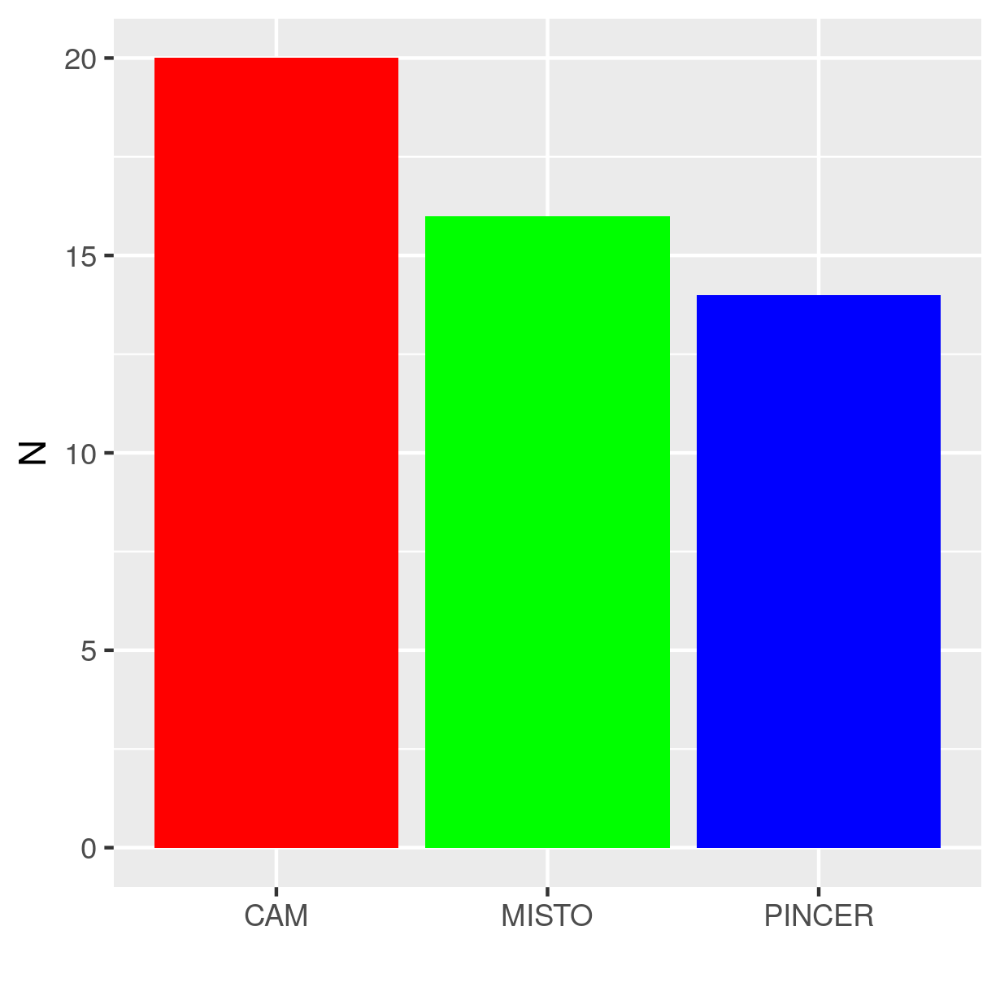
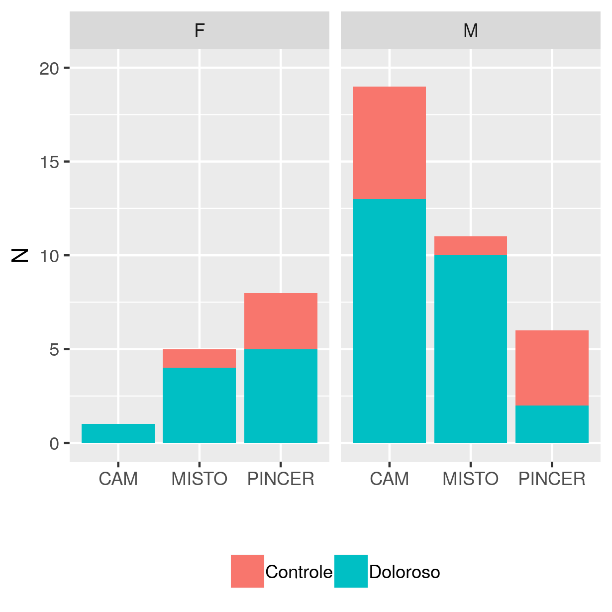
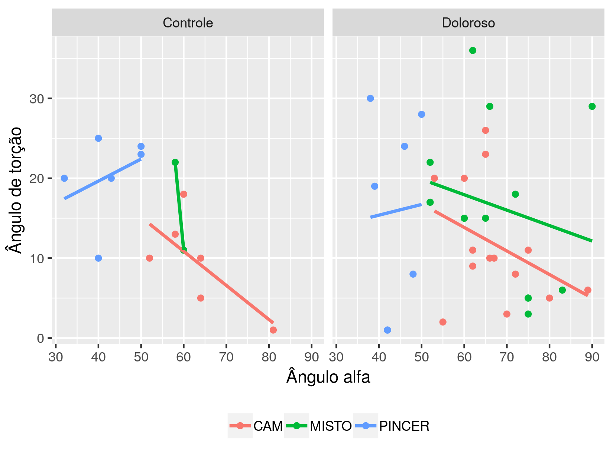

---

**Histórico do documento**


| Versão |   Alterações   |
|:------:|:--------------:|
|   01   | Versão inicial |

---

# Lista de abreviaturas

# Introdução

## Objetivos

## Recepção e tratamento dos dados

# Metodologia

## Diagnóstico sistemático

As medidas obtidas por avaliação clínica e radiológica foram utilizadas para classificar sistematicamente o tipo de impacto.
Foram considerados impactos CAM aqueles participantes que tinham ângulo alfa maior que 50 graus.
Para classificar o impacto do tipo PINCER foi considerada qualquer uma das seguintes medidas:

- índice acetabular negativo;
- ângulo centro-borda acetabular maior que 39 graus;
- índice de extrusão menor que 10 graus.

Participantes que possuíam tanto impacto CAM quanto PINCER no mesmo lado do quadril foram posteriormente classificados como impacto MISTO.
Observe que isto não considera um paciente com CAM em um lado e PINCER no outro como um paciente de impacto MISTO.

### Exceções

**CAM**

Um participante não teve seu ângulo alfa mensurado no lado direito, ele foi diagnosticado clinicamente como não possuindo impacto CAM.

**PINCER**

Um segundo participante não teve seu ângulo centro-borda acetabular mensurado no lado direito, e seu diagnóstico clínico foi de que não possuía PINCER.
Um terceiro participante não teve seus índices de extrusão mensurados em ambos os lados.
Seu diagnóstico clínico foi de que possuía PINCER apenas no quadril esquerdo.

## Análises estatísticas

As variáveis categóricas foram avaliadas quanto às suas frequências, sendo apresentadas em porcentagem.
Associações entre duas variáveis categóricas foram avaliadas usando-se o teste exato de Fisher.
As variáveis contínuas foram descritas com médias e desvio padrão.
As diferenças médias entre dois grupos de medidas foram avaliadas com o teste t de Student.

Além dos testes de significância, diversos modelos estatísticos foram criados para avaliar hipóteses sobre a relação entre os desfechos de interesse e os ângulos mensurados, como torção.

<!-- Para as hipóteses em que o desfecho era uma variável categórica binária, foi utilizado o modelo de regressão logística. -->
Quando o desfecho era uma variável categórica com 3 ou mais categorias, como por exemplo o lado doloroso (direito, esquerdo ou bilateral) usou-se o modelo de regressão multinomial.

Esta estratégia de modelagem permite estimar a Razão de Chance de uma determinada combinação de fatores e medidas afetar a probabilidade de trocar de uma categoria para outra.
Por exemplo, o tipo de impacto que o participante apresenta pode aumentar a chance do participante sentir dor naquele lado, mas isso pode ocorrer de forma diferenciada para cada gênero, ou ser influenciada pelo ângulo de torção, IMC, etc.
Assim é possível controlar o efeito observado por outros fatores que possam estar relacionados.

Para avaliar a influência de diversos fatores na medida do ângulo de torção, foram usados modelos de regressão linear múltipla, o que permite controlar a observação do efeito por fatores adicionais que possivelmente influenciam no valor deste ângulo.

Todas as análises foram realizadas utilizando-se o software `R` versão 3.4.4.

<!-- The exact confidence intervals (CIs) of binomial proportions were calculated using package `exactci` (version 1.3.3). -->

# Resultados


## Descrição dos participantes do estudo

A Tabela 1 apresenta as características gerais dos participantes do estudo.


|        &nbsp;         | level |       F       |       M       |   p    |
|:---------------------:|:-----:|:-------------:|:-------------:|:------:|
|         **n**         |       |       7       |      19       |        |
| **IDADE (mean (sd))** |       | 35.00 (6.38)  | 35.00 (6.98)  | 1.000  |
|  **IMC (mean (sd))**  |       | 19.54 (2.44)  | 25.67 (3.36)  | <0.001 |
|      **DOR (%)**      |   D   |   4 ( 57.1)   |   9 ( 47.4)   | 0.415  |
|                       |   E   |   0 (  0.0)   |   4 ( 21.1)   |        |
|                       |   B   |   3 ( 42.9)   |   6 ( 31.6)   |        |
|  **HHS (mean (sd))**  |       | 73.71 (14.58) | 64.68 (12.23) | 0.125  |

Table: **Tabela 1** Descrição dos participantes do estudo (N = 26).
sd = Desvio padrão,
IMC = Índice de massa corpórea,
HHS = Harris hip score (modificado),
p = teste t de Student para variáveis contínuas, e teste exato de Fisher para DOR.

O IMC médio dos homens é significativamente maior que o das mulheres.
A idade média, lado doloroso e o Harris Hip Score dos participantes de cada gênero apresentou boa homogeneidade quanto aos gêneros.

A tabela 2 mostra as mensurações obtidas dos quadris classificados quanto aos grupos Doloroso e Controle.


|         &nbsp;         |   Controle    |   Doloroso    |   p   |
|:----------------------:|:-------------:|:-------------:|:-----:|
|         **n**          |      17       |      35       |       |
| **TORCAO (mean (sd))** | 14.76 (8.07)  | 14.49 (9.61)  | 0.918 |
|  **ALFA (mean (sd))**  | 53.25 (11.80) | 62.43 (13.55) | 0.024 |
|   **IA (mean (sd))**   |  0.94 (4.90)  |  1.06 (5.06)  | 0.938 |
|  **ACB (mean (sd))**   | 32.62 (9.06)  | 33.63 (7.97)  | 0.691 |
|   **IE (mean (sd))**   | 16.76 (13.91) | 13.67 (10.65) | 0.385 |

Table: **Tabela 2** Descrição das mensurações avaliadas e os tipos de impacto em cada grupo.
sd = Desvio padrão,
ALFA = ângulo alfa,
IA = índice acetabular,
ACB = ângulo centro-borda acetabular,
IE = índice de extrusão.
p = teste t de Student.

Observou-se que, na média, o ângulo alfa foi significativamente maior nos quadris dolorosos.
As outras mensurações parecem ser homogeneamente distribuídas em ambos os grupos.

## Ocorrência dos tipos de impacto fêmoro-acetabular

A figura xx mostra a frequência com que cada tipo de impacto ocorreu nos quadris estudados.




Os impactos do tipo CAM e PINCER parecem ocorrer com frequências semelhantes (p = 0.9258).

Uma hipótese na literatura é de que a ocorrência de MISTO (CAM+PINCER) é o mais comum (FIXME: REF).
Isto não foi observado neste estudo.
Quadris com impacto MISTO por outro lado são significativamente menores que os impactos CAM (p = <0.001) e PINCER (p = 0.0308).
Os quadris com impacto MISTO são os menos frequentes na amostra aqui estudada.

### Associação da ocorrência do impacto fêmoro-acetabular por gênero

[FIXME: retirar]
Os impactos ocorrem de forma diferenciada por gênero?
(p = 0.00266)

A fim de confirmar as hipóteses documentadas na literatura, avaliamos a diferença entre as prevalências dos impactos do tipo CAM e PINCER em cada gênero.
As prevalências observadas neste estudo podem ser vistas na figura 32.




Tomando o gênero feminino como referência apresentamos os resultados relativos para os homens.

Nossos resultados indicam que o impacto do tipo CAM realmente acomete mais homens.
Em nossa amostra, CAM é 3.8 vezes vezes mais frequente em homens que em mulheres (p = 0.019).

Nossa amostra também indica que impactos do tipo PINCER é 93% menos frequente em homens que em mulheres (p = 0.00174).
Confirma-se a maior prevalência de PINCER em mulheres.

Não há evidências em nossa amostra de o impacto do tipo MISTO acometa mais homens que mulheres (p = 0.738).

### Associação da ocorrência do impacto fêmoro-acetabular por grupo de estudo

O tipo de impacto está associado com a dor?
<!-- (p = 0.0852) -->


CAM é 3.4 vezes mais frequente nos quadris dolorosos (p = 0.025).

PINCER não é significativo (p = 0.767).

MISTO não é significativo (p = 0.0554).

## Torção femoral

### Associação entre a torção femoral e os tipos de impacto fêmoro-acetabular


A torção média dos quadris que possuem impacto do tipo CAM não é significativamente dos controles (p= 0.234).

A torção média dos quadris que possuem impacto do tipo PINCER observada foi de 16.63, maior que a média dos controles de 11.77 (p= 0.0455).

A torção média dos quadris que possuem impacto do tipo MISTO não é significativamente dos controles (p= 0.314).

### Correlação entre a torção femoral e o ângulo alfa

O ângulo de torção é negativamente correlacionado com o ângulo alfa (r = -0.31, p = 0.0289).
A figura 33 mostra a reta de regressão que associa as mensurações destes ângulos.

[FIXME: observar que esta correlação é global]


[FIXME: descrever o resultado da regressão linear torção ~ alfa global]

Considerando cada grupo de estudo (quadris dolorosos e quadris controle), este resultado é inconsistente (figura 33).
O ângulo de torção é negativamente correlacionado com o ângulo alfa (r = -0.63, p = 0.00933) no grupo controle, mas a correlação não é significativa no grupo de quadris dolorosos
(r = -0.21, p = 0.233).

Sob a hipótese de uma associação linear entre o ângulo de torção femoral como função do ângulo alfa, ajustou-se modelos de regressão linear para cada grupo.
A correlação negativa tem efeito menos marcante no grupo de quadris dolorosos que no grupo controle (figura 34).
Controlando pelo grupo de estudo, a associação permanece significativamente negativa no grupo controle (p = 0.0093).
Este modelo indica que para cada aumento de um grau no ângulo alfa, há uma diminuição de aproximadamente 0.40 graus no ângulo de torção.
Uma relação linear não pode mais ser detectada no grupo de quadris dolorosos (p = 0.23).


<!-- ```{r echo=FALSE, warning=FALSE, fig.cap="**Figura xx** Correlação entre Torção e Alfa, por grupo"} -->
<!-- alftor.grupo.imp -->
<!-- ``` -->

Quando controlamos pelo tipo de impacto, não é mais possível identificar associação entre os ângulos (figura 35).
Esta aparente correlação negativa no grupo controle parece ter sido afetada pelo baixo número de pacientes com impacto misto - há apenas 2 pacientes nesta categoria.
Isto impede uma estimativa representativa para este cenário em particular, e perturba a estimativa o modelo global.

<!-- Obs: na verdade, retirar todos os pacientes MISTO não impacta nos resultados e conclusões. -->



### Quadris com ângulo de torção femoral alterada

# Conclusões

# Referências

# Apêndice

